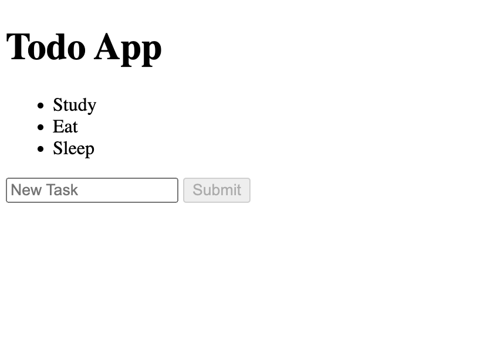

# ToDo App Exercise - HTML and JavaScript

Welcome to the ToDo App Exercise! In this assignment, you will build a basic ToDo application using only HTML and JavaScript. The primary objective of this exercise is to get hands-on experience with the fundamentals of web development and understand the interaction between HTML and JavaScript.

## 🎯 Objective:
Your task is to create a simple ToDo application that allows a user to:

1. Enter a task using a form.
2. View the entered task appended to an unordered list on the page.

You'll only write in the `exercise.html` file. 
In case you need to see the solution, it is at `answer.html`.

## ✅ Specific Tasks:
### 1. Set Up the HTML:
- Create a form element with an input field where users can type their tasks.
- Add a button within the form that users can click on to add their task.
- Create an unordered list (`<ul>`) element where the tasks will be displayed as list items (`<li>`).

### 2. Set Up the JavaScript:
- Add an event listener to the form to detect when it's submitted.
- When the form is submitted, prevent its default behavior (which might refresh the page).
- Retrieve the task entered by the user from the input field.
- Create a new list item (`<li>`) and set its inner text or inner HTML to the task retrieved.
- Append this list item to the unordered list in the HTML.
- Clear the input field to allow for the entry of a new task.

## 📘 How to Run Your Website:
1. Navigate to the root directory of this exercise in your terminal or command prompt.
2. Run the command `htpp-server`

## 🚀 How to Run Tests:
After completing the exercise, you can run the provided tests to ensure that your ToDo application is functioning as expected:

1. Go to the terminal
2. Run the command `npm install` to install the necessary testing dependencies (only needs to be done once).
3. Run the command `sudo apt-get update` and then `sudo apt-get install -y libxshmfence1`
4. Run the command `npm test` to execute the tests.
5. If all goes well, you should see a message indicating the tests that passed. If there are issues, the failed tests will provide hints or messages to help you identify the problem.

## 🤔 How to Submit:
Once all the tests have completed:
1. Stage Changes:
  - View your changes in the Source Control view.
  - Click on the + (plus) sign next to the files you wish to stage.
2. Commit Changes:
  - Enter a descriptive commit message.
  - Press Ctrl + Enter (or Cmd + Enter on macOS) to commit the changes.
3. Push Changes:
  - Click on the ellipsis ... in the Source Control view.
  - Select Push.
4.Verify you code has passed

## How the Project will Look Like

